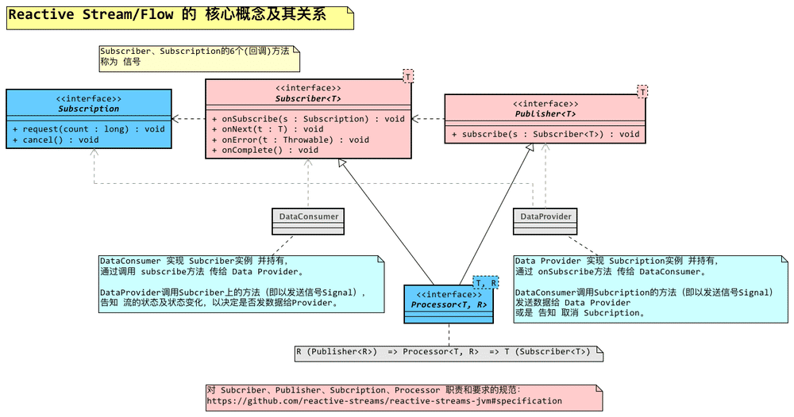
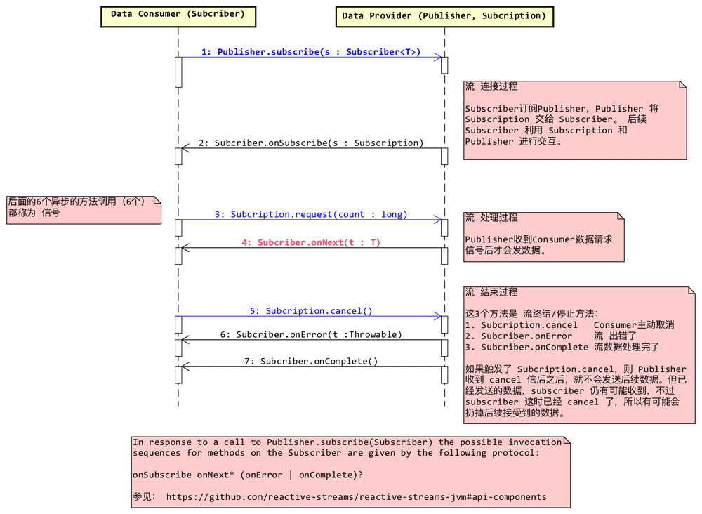

# `Flow Arch`(流式架构)/`Reactive Programming`(`RP`/反应式编程) Practice

> One way ticket and of life to live, pockets full of sunshine, lots of love to give. -- [La La Love On My Mind, Ann Winsborn](http://www.xiami.com/song/mQ37ro8c0de)  
> 体验生命的单程票，装满阳光口袋可以给你许许多多的爱。 —— [La La Love On My Mind, Ann Winsborn](http://www.xiami.com/song/mQ37ro8c0de)
>
> 因为单程（`one-way`）的生命，所以我们才能并需要全力生活。
>
> 异步（`async`）的系统，像这首歌一样流畅的节奏停不下来（`non-blocking`）。
>
> 点了[链接](http://www.xiami.com/song/mQ37ro8c0de)听听，摇起来～

----------------------------------------------------

<!-- START doctoc generated TOC please keep comment here to allow auto update -->
<!-- DON'T EDIT THIS SECTION, INSTEAD RE-RUN doctoc TO UPDATE -->

- [什么是 `Reactive`/反应式](#%E4%BB%80%E4%B9%88%E6%98%AF-reactive%E5%8F%8D%E5%BA%94%E5%BC%8F)
- [准备/学习/了解的资料/书籍](#%E5%87%86%E5%A4%87%E5%AD%A6%E4%B9%A0%E4%BA%86%E8%A7%A3%E7%9A%84%E8%B5%84%E6%96%99%E4%B9%A6%E7%B1%8D)
    - [`Java 8`](#java-8)
    - [`RxJava`](#rxjava)
    - [函数式编程](#%E5%87%BD%E6%95%B0%E5%BC%8F%E7%BC%96%E7%A8%8B)
- [有哪些相关的类/库](#%E6%9C%89%E5%93%AA%E4%BA%9B%E7%9B%B8%E5%85%B3%E7%9A%84%E7%B1%BB%E5%BA%93)
    - [1. `Java 8`的`Stream`](#1-java-8%E7%9A%84stream)
    - [2. `ReactiveX`(`Rx`)/`RxJava`](#2-reactivexrxrxjava)
    - [3. `Reactive Streams`(`RS`)](#3-reactive-streamsrs)
- [Reactive Streams介绍](#reactive-streams%E4%BB%8B%E7%BB%8D)
- [相关资料](#%E7%9B%B8%E5%85%B3%E8%B5%84%E6%96%99)

<!-- END doctoc generated TOC please keep comment here to allow auto update -->

----------------------------------------------------

# 什么是 `Reactive`/反应式

`Reactive`说明了

- 技术系统应用达成的 **期望要求**
- 架构上的 **思路理念**
- 技术上的 **核心手段**

即也是`Reactive`本身的定义。具体参见：

- [响应式宣言](https://www.reactivemanifesto.org/zh-CN)
- 中文翻译得有些别扭，可以对照着英文原版看：[**_The Reactive Manifesto_**](https://www.reactivemanifesto.org/)。

# 准备/学习/了解的资料/书籍

全异步化/流式架构 需要 捕捉操作并编排运行（延迟执行）。

- 捕捉操作需要`Java 8 Lambda`语法的支持来精简表达。
- 编排执行表达了业务逻辑。如何有效表达编排（即业务逻辑）对应了 `FP`上的思路做法。
    - `OOP` 有效表达了 **业务概念**（模型/数据）
    - 而`FP` 则有效表达了 **业务逻辑**（流程/转换）
    - 两者互为补充

## `Java 8`

- [《Java 8实战》](https://book.douban.com/subject/26772632/)：面向Java 8的技能升级，包括Lambdas、流和函数式编程特性。
    - 实战系列的一贯风格让自己快速上手应用起来。
    - `Java 8`支持的`Lambda`是精简表达在语法上提供的支持。
    - `Java 8`提供了`Stream`，学习和使用可以建立流式编程的认知。
- [《Java 8函数式编程》](https://book.douban.com/subject/26346017/)
    - Java 8的函数式用法的入门佳作，非常薄148面，简直不敢相信这么小的篇幅讲了这么多内容。
    - 第9章讲并发程序编写，只短短10来面就广度了不少内容，  
        几个关键点及其关联异同的讲解闪烁着思辨的光辉，很是精彩！ 🌈

## `RxJava`

- [《Learning RxJava: Reactive Programming with Java and ReactiveX》](https://book.douban.com/subject/27094562/) 英文版 2017年6月出版
    - `RxJava 2`，循序渐进地介绍了使用和整体思路，推荐！
    - 第一章 **_Thinking Reactively_**，讲了反应式设计和编程上的世界观和理念，推荐赶紧看看先～ 😘
- [《Reactive Programming in Kotlin: Design and build non-blocking, asynchronous Kotlin applications with RXKotlin, Reactor-Kotlin, Android, and Spring》](https://book.douban.com/subject/27094562/) 英文版 2017年12月出版
    - 也相当不错。用的是`Kotlin`语言。
- [《Reactive Programming with RxJava: Creating Asynchronous, Event-Based Applications》](https://book.douban.com/subject/26894199/) 英文版 2016年10月出版
    - 讲的是`RxJava 1`，思路是无区别的，也可以看看。

## 函数式编程

- [《函数式编程思维》](https://book.douban.com/subject/26587213/)：科普读物。
- [《Java函数式编程》](https://book.douban.com/subject/27594722/)：讲的主题是函数式编程，用Java语言描述。
    - 包含：`FP`思维、`FP`基础类库的讲解，偏重思想和基础。有了思维和基础，实际的实践和应用就会举重若轻。
    - 讲解得平实、循序渐进，所以书有点厚500面
    - 基于`Java`语言描述、手把手的构建`FP`的基础运行时结构，极大地降低了深入理解`FP`的门槛和难度。
    - 书评/译序 http://qinghua.github.io/functional-programming-in-java/

# 有哪些相关的类/库

这里列的是比较广泛的相关。使用方式和思考方式是互通的，大家去学习和理解。

##  1. `Java 8`的`Stream`

即包`java.util.stream`。

- [Java 8 中的 Streams API: Streams 的背景，以及 Java 8 中的使用 - IBM](https://www.ibm.com/developerworks/cn/java/j-lo-java8streamapi/)
- [`java.util.stream`的官方`JavaDoc`](https://docs.oracle.com/javase/8/docs/api/java/util/stream/package-summary.html)

## 2. `ReactiveX`(`Rx`)/`RxJava`

`ReactiveX`（`Rx`）是 `Reactive eXtension`（`Reactive`扩展）的缩写。

提供了`Reactive`编程支持，提供配套设施/工具的实现。

- 官网 http://reactivex.io/
- `RxJava 2`的[`Flowable`类的`JavaDoc`文档](http://reactivex.io/RxJava/2.x/javadoc/io/reactivex/Flowable.html)，图文并茂，非常值得一读！
    - [`RxJava 2`的`JavaDoc`文档首页](http://reactivex.io/RxJava/2.x/javadoc/io/reactivex/package-summary.html#package.description)
- `GitHub`仓库 https://github.com/ReactiveX/RxJava
- [可视化`Reactive`操作符 - RxJS Marbles](http://rxmarbles.com)，可拖拽元素去理解每一个操作符的含义，非常值得玩一玩！

## 3. `Reactive Streams`(`RS`)

`Reactive Streams`（`RS`）规范 **简单了解** 一下就好～  
\# 在Java中，即是Java9 Flow API。

`Reactive`的核心设计思路和底层模式，`RS`只提供的了`API`（4个接口）及规范（这个接口及其之间的实现契约），不包含实现。

> - 『核心』是指：全能、极简
> - 『底层』是指：比较原始，业务开发一般不会使用直接使用/实现这个`API`来编写业务逻辑。
>
> ------------------------
>
> `Rx`是业务开发使用的框架/库，而`Reactive Streams`是规范API。
>
> 在`Java`中，`RxJava`与`Reactive Streams`的关系，可以类比成：
>
> - `Spring MVC`与`Servlet API`
> - `MyBatis`与`JDBC API`

- 官网 http://www.reactive-streams.org/
- `RS`规范的`GitHub`仓库，包含了
    - 规范概述 https://github.com/reactive-streams/reactive-streams-jvm#reactive-streams
    - 规范及其设计上的用意 https://github.com/reactive-streams/reactive-streams-jvm#specification
    - `Java`语言描述的
        - 接口代码
        - `TCK`（即 规范兼容测试套件）代码

# Reactive Streams介绍

[.](asserts/reactive-stream-n-flow-design.asta)

[.](asserts/reactive-stream-n-flow-design.asta)

# 相关资料

- 在软件大会上自己做的主题分享
    - QCon2018北京 分享 @ 2018-4-21：
        - [Reactive架构升级实践 —— 淘宝全站业务的全异步流式架构升级](https://2018.qconbeijing.com/presentation/462)
        - [PPT的`PDF`文件](Reactive架构升级实践-李鼎-20180421-QCon北京.pdf)
    - 2018携程技术峰会 分享 @ 2018-11-23：
        - [Reactive架构升级实践 —— 淘宝全站业务的全异步流式架构升级](https://techsummit.ctrip.com/2018/index.html)
        - [PPT的`PDF`文件](淘宝应用架构升级-20181123-携程技术峰会.pdf)
        - 进一步包含2018双11的进展
    - 2019 TOP100全球软件案例研究峰会 分享 @ 2019-11-16：  
        - [面向流量的自适应高可用架构 —— 淘宝应用架构升级实践](https://www.top100summit.com/detail?id=14331)
        - [PPT的`PDF`文件](面向流量的自适应高可用架构-淘宝应用架构升级实践-李鼎-20191116-Top100.pdf)
        - 对应于`Reactive`架构/系统设计中的`Responsive to workload/Elastic`，或者说成上面我表达成的『面向流量/负载』的高可用 :)
        - 分享过去一年多的思考、实现 与 2019双11实践落地及其收益效果。
        - 高可用(HA) 不单是 **应对资源失效的高可用**，还有 **面向流量的高可用**。  
          在今天对于应用架构来说，后者更是痛点，但业界的关注、思路、实践要落后很多。
        - 让我们一起更多地关注 **面向流量的高可用**！大家和业界能更多正面思考与解决这只屋子里的大象：  
          流量不确定性带来的稳定性问题！
- Reactive Programming
    - [Reactive Programming with JDK 9 Flow API - oracle.com](https://community.oracle.com/docs/DOC-1006738)
    - [Your Mouse is a Database - acm.org](https://queue.acm.org/detail.cfm?id=2169076)
    - https://github.com/lucamezzalira/awesome-reactive-programming
- Rx
    - https://github.com/eleventigers/awesome-rxjava
    - https://github.com/riiid/awesome-rx
- FP
    - http://www.vavr.io/ | https://github.com/vavr-io/vavr
